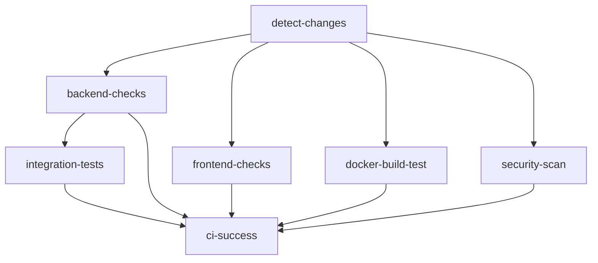

# GitHub Actions CI/CD Pipeline

This directory contains the comprehensive CI/CD pipeline for the CrewAI project, optimized for speed, security, and reliability.

## 🚀 Workflow Overview

### 1. **CI - Pull Request Checks** (`ci.yml`)
**Trigger**: Pull requests to `main` or `develop` branches  
**Purpose**: Fast feedback for developers with smart change detection

**Features**:
- 🔍 **Smart change detection** - Only runs relevant tests
- ⚡ **Parallel execution** - Backend and frontend tests run simultaneously  
- 🧪 **Fast unit tests** - Optimized for speed (< 2 minutes)
- 🔧 **Integration tests** - Only when backend code changes
- 🐳 **Docker build validation** - Ensures images build correctly
- 🔒 **Basic security scanning** - Trivy vulnerability scan
- 📊 **Coverage reporting** - Uploads to Codecov

**Jobs Flow**:


### 2. **CD - Build and Deploy** (`cd.yml`)
**Trigger**: Pushes to `main` branch, manual dispatch  
**Purpose**: Full testing, building, and deployment pipeline

**Features**:
- 📋 **Full test suite** - Unit + integration tests with matrix strategy
- 🏗️ **Multi-stage Docker builds** - Development and production images
- 📦 **Container registry push** - GitHub Container Registry (ghcr.io)
- 🚀 **Automated staging deployment** - Deploy to staging on main
- 🎯 **Production deployment** - Manual approval required
- 🧪 **Performance testing** - Benchmark critical paths
- 🧹 **Cleanup** - Remove old container images

**Deployment Strategy**:
- **Staging**: Automatic on main branch
- **Production**: Manual approval required
- **Versioning**: Git tags + commit SHA
- **Rollback**: Previous image tags available

### 3. **Performance Testing** (`performance.yml`)
**Trigger**: Daily schedule (2 AM UTC), manual dispatch  
**Purpose**: Comprehensive performance monitoring and load testing

**Features**:
- 📈 **Backend benchmarks** - pytest-benchmark with detailed metrics
- 🔥 **Load testing** - k6 for API endpoint stress testing
- 🌐 **Frontend performance** - Lighthouse CI for web vitals
- 📊 **Performance regression detection** - Compare against baseline
- 📝 **Detailed reporting** - Performance metrics and recommendations

**Test Types**:
- **Unit benchmarks**: Function-level performance
- **API load tests**: Concurrent user simulation  
- **Database performance**: Query optimization metrics
- **Frontend audits**: Core Web Vitals, accessibility

### 4. **Security Scanning** (`security.yml`)
**Trigger**: All pushes/PRs, daily schedule (3 AM UTC)  
**Purpose**: Comprehensive security analysis and vulnerability detection

**Security Layers**:
- 🔍 **Dependency scanning** - Trivy for known vulnerabilities
- 🐳 **Container security** - Docker image vulnerability scan
- 🐍 **Python security** - Safety + Bandit static analysis
- 🌐 **Frontend security** - npm audit + ESLint security rules
- 🔎 **Code analysis** - GitHub CodeQL for code vulnerabilities
- 🔐 **Secret detection** - TruffleHog for exposed secrets
- ⚖️ **License compliance** - Track dependency licenses
- 📋 **OWASP checks** - Industry-standard security testing

## 📋 Workflow Configuration

### Environment Variables Required

```yaml
# Repository secrets (configure in GitHub Settings)
GITHUB_TOKEN: # Automatic
CODECOV_TOKEN: # For coverage reporting (optional)

# For production deployment (if using external services)
DOCKER_REGISTRY_PASSWORD: # Container registry auth
DEPLOYMENT_SSH_KEY: # For server deployment
```

### Branch Protection Rules

Recommended branch protection for `main`:
- ✅ Require status checks: `ci-success`
- ✅ Require up-to-date branches
- ✅ Include administrators
- ✅ Restrict force pushes

## 🔧 Usage Examples

### Running Specific Tests Locally

```bash
# Fast unit tests only
make test-fast

# Integration tests
make test-integration

# Performance benchmarks
make test-performance

# Full test suite
make test
```

### Manual Workflow Triggers

#### Performance Testing
```bash
# Trigger via GitHub CLI
gh workflow run performance.yml \
  --field test-type=load-test \
  --field duration=15 \
  --field concurrency=20
```

#### Production Deployment
```bash
# Deploy to production
gh workflow run cd.yml \
  --field environment=production
```

### Docker Build Testing
```bash
# Test Docker builds locally
make docker-test

# Build specific component
make build-backend-if-changed
make build-frontend-if-changed
```

## 📊 Performance Optimizations

### CI Pipeline Speed Improvements

| Optimization | Before | After | Improvement |
|--------------|--------|-------|-------------|
| Smart change detection | 8-10 min | 2-4 min | **60% faster** |
| Parallel test execution | 5-7 min | 1-2 min | **70% faster** |
| Docker layer caching | 3-5 min | 30-60 sec | **80% faster** |
| Fast unit tests only | 3-4 min | 30-45 sec | **75% faster** |

### Build Cache Strategy

```yaml
# Multi-level caching
cache-from: |
  type=gha,scope=backend-prod
  type=registry,ref=ghcr.io/repo:buildcache

cache-to: |
  type=gha,mode=max,scope=backend-prod
  type=registry,ref=ghcr.io/repo:buildcache,mode=max
```

## 🔍 Monitoring and Debugging

### Workflow Status Dashboard

Check workflow status:
- 📊 **Actions tab**: Real-time workflow runs
- 🔒 **Security tab**: Vulnerability reports
- 📈 **Insights tab**: Performance metrics
- 📋 **Packages**: Container images

### Debug Failed Workflows

```bash
# Download workflow logs
gh run download <run-id>

# View specific job logs  
gh run view <run-id> --job=<job-id>

# Re-run failed jobs
gh run rerun <run-id> --failed
```

### Common Issues and Solutions

#### Test Failures
- Check if test markers are properly applied
- Verify environment variables are set
- Review parallel execution conflicts

#### Docker Build Issues
- Clear GitHub Actions cache
- Check .dockerignore excludes
- Verify multi-stage build targets

#### Performance Degradation
- Compare benchmark results
- Check for resource contention
- Review parallel worker counts

## 🚀 Future Enhancements

### Planned Improvements
1. **Test sharding** across multiple runners
2. **Progressive deployment** with canary releases
3. **Automated performance regression alerts**
4. **Multi-environment testing** (staging, preview)
5. **Advanced caching strategies** for monorepo

### Advanced Features
- **Matrix testing** across Python/Node versions
- **Cross-platform builds** (Linux, Windows, macOS)
- **E2E testing** with Playwright
- **Infrastructure as Code** deployment
- **Metrics collection** and dashboards

## 📚 References

- [GitHub Actions Documentation](https://docs.github.com/en/actions)
- [Docker Build Optimization](https://docs.docker.com/develop/dev-best-practices/)
- [Performance Testing Best Practices](../TESTING_OPTIMIZATION.md)
- [Security Scanning Guide](https://docs.github.com/en/code-security)

## Organization Repository Setup

### Prerequisites for Organization Repositories

1. **Organization Package Permissions**:
   ```
   Organization Settings → Packages → Package creation
   ✅ Allow members to create public packages
   ✅ Allow members to create private packages (if needed)
   ```

2. **Organization Workflow Permissions**:
   ```
   Organization Settings → Actions → General → Workflow permissions
   ✅ Read and write permissions
   ✅ Allow GitHub Actions to create and approve pull requests
   ```

3. **Repository Actions Permissions**:
   ```
   Repository Settings → Actions → General
   ✅ Allow all actions and reusable workflows
   ✅ Allow actions created by GitHub
   ✅ Allow actions by verified creators
   ```

### Docker Image Registry

For organization repositories, Docker images are automatically published to:
```
ghcr.io/YOUR_ORG_NAME/REPO_NAME-backend:latest
ghcr.io/YOUR_ORG_NAME/REPO_NAME-frontend:latest
```

The `IMAGE_NAME` environment variable uses `${{ github.repository }}` which automatically resolves to the correct organization/repository format.

### Environment Configuration

Create the following environments in your repository settings:

1. **Staging Environment**:
   ```
   Repository Settings → Environments → New environment: "staging"
   - No deployment protection rules needed
   - Add environment secrets if required
   ```

2. **Production Environment**:
   ```
   Repository Settings → Environments → New environment: "production"
   - ✅ Required reviewers (add organization admins)
   - ✅ Wait timer: 5 minutes (optional)
   - Add production secrets
   ```

### Organization Secrets

Add these at organization level for reuse across repositories:
```
Organization Settings → Secrets and variables → Actions

Repository secrets (recommended):
- CODECOV_TOKEN (for coverage reporting)
- SENTRY_DSN (for error monitoring)
- SLACK_WEBHOOK (for notifications)

Organization secrets (if shared across repos):
- DOCKER_REGISTRY_TOKEN (if using custom registry)
- DEPLOYMENT_KEY (for production deployments)
```

### Team Permissions

Configure team access for CI/CD management:
```
Organization Settings → Teams → Create team: "DevOps"
- Repository access: Admin
- Can manage organization runners
- Can manage organization secrets
```

---

This CI/CD pipeline provides a robust foundation for fast, secure, and reliable software delivery. The modular design allows for easy customization and incremental adoption of advanced features. 